Today began like most days do not: up at 5 am, staring at a scooter in the pouring rain, wondering if this trip was a good idea. Most adventures aren't, but that hasn't stopped anyone before.

My favorite personal fault is that when I commit to doing something, I do it regardless if it makes sense or not. Accordingly, I pressed the button to bring the BMW CE-04 to life as thunder reverberated across my recently adopted hometown of Chapel Hill, NC.

Today’s goals were the [Town Creek Indian Site](https://historicsites.nc.gov/all-sites/town-creek-indian-mound), lunch with a friend, and a quaint bed and breakfast in Rutherfordton, NC - some 200 miles direct - but the straightest routes in life are always the dullest.

### **Flashes & Floods**

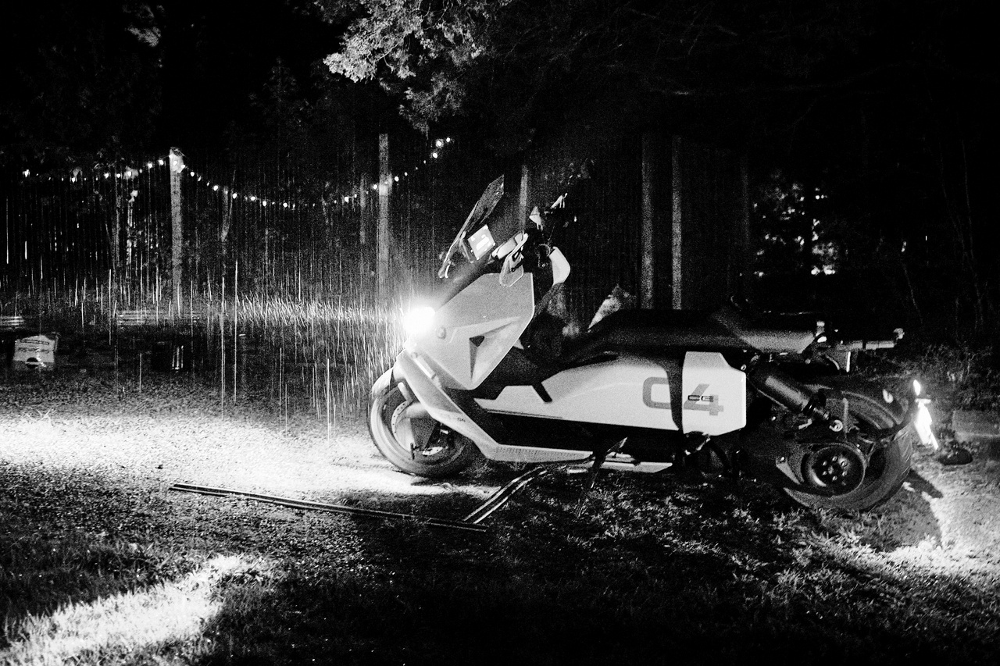

<!--more-->

It is raining absolutely cats, dogs, and wombats. I'm glad I loaded the bike up the night before, even if it means I have to unload the rain jacket and rain pants as the thunder rumbles in the background. In the pitch-black rain, I head, nervous enough that I accidentally trigger ABS before making it out onto the main road. I'm a bit more careful as I wade through downtown Chapel Hill, the UNC campus, and onto 15-501.

As I pull onto the 4-lane highway south toward Pittsboro, the weather intensifies. Lightning is dancing around me in all directions, and the rain hits the road so hard that it splashes back upwards. Visibility is poor: without my brights on, I have difficulty seeing the lane markings, but due to oncoming traffic, they are off most of the time.

Doubts swirl through my head: is this insanity? Is the reason why lightning strikes rarely hit humans because most of them are smart enough to stay home when bolts are visible? Is 1.7mm of tire tread enough to avoid hydroplaning? I pull into a gas station for a moment - if only to put a pair of waterproof socks on.

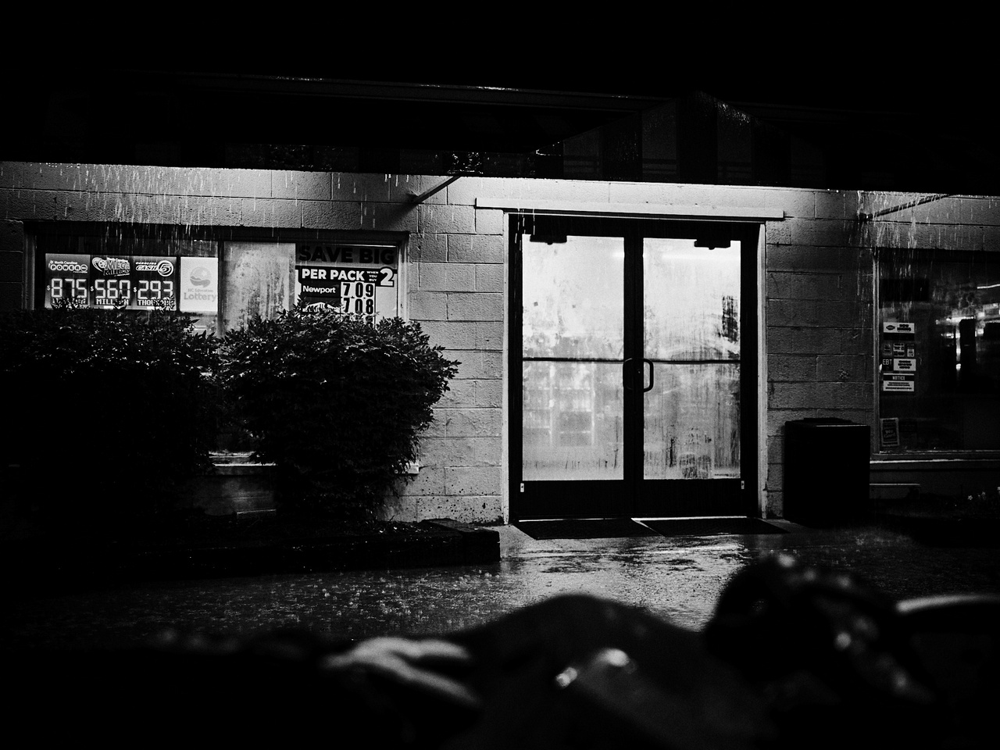

If I hang out here for even 30 minutes, it will blow my schedule off course, so after a minute or two, I suck it up and hit the road again. I tell myself that as long as I can make it to my charging stop in Goldston, I can hide under a shelter there and delay for a while.

The strength of the storm pulses in and out. My watch is buzzing with notifications, but at this point, I'm not stopping for anything. Pittsboro is a blur. I turn off onto Highway 902 toward Goldston, glad that I had at least rehearsed this section earlier in the week so that I know that the road conditions are good. I'm thankful that the rain keeps the deer off the road at this hour.

Crossing over George's Creek, I suddenly hear a loud "whoosh" sound as my front wheel dives through a stream of water that I never saw. As the water smashes the underside of my bike, the sound reminds me of being inside a loud carwash. It hit so hard that my feet could feel the impact reverberate through the battery pack and the rubber footrest. My speed instantly drops from 40mph to 28mph before the "Throttle it out when in doubt" mantra hits, and I leave the overflowing creek behind me.

I'm so regretting my decision to nix purchasing an Insta360 because even in the dark, the crossing must have looked crazy. The rain begins to let up, but I keep things slow afterward anyways.

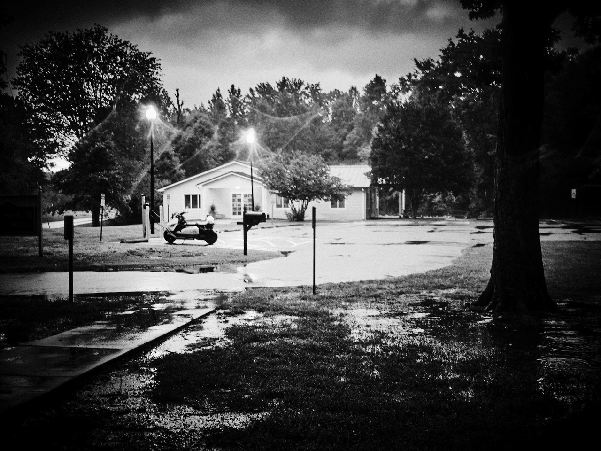

I stop off at the [Goldston Library](https://www.chathamcountync.gov/government/departments-programs-i-z/library/locations-hours/goldston-library?locale=en) to charge: it's only 32 miles from home, but it's precisely on my route, and the next stop is just about at my 65-mile range limit for rural highways. I arrive with 52% - I only need a 5-minute charge to make it to my next stop, but I decided to try waiting out the rain. The library has no covered area, so I hid beneath a tree, and within 25 minutes, the storm finally ended.

### **Star: The Geographic Center of the Universe**

With the rain halted, I tear out of the parking lot and notice the dawn coming up behind me. My mood improves.

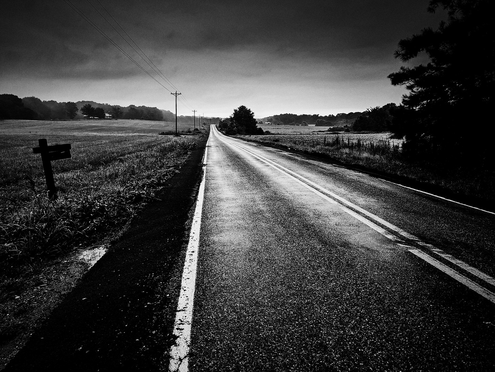

I note that with the rain gone, the deer will come out soon to eat once they've dried off. I'm scared as hell of deer and take special notice whenever I pass through an area with a forest on one side of the road and a field on the other. If a deer can take out Mr. Safety, it can take me out too.

By the time I hit Highway 24 toward Biscoe, the roads have dried off, and I pick up the pace to make up for lost time. The increasing frequency of signs relating to pottery let me know that I'm not far from Seagrove, AKA the "Pottery Capital of the United States." Some miles away from my destination of Star, NC, I get a little reminder of the cost of all that extra velocity.

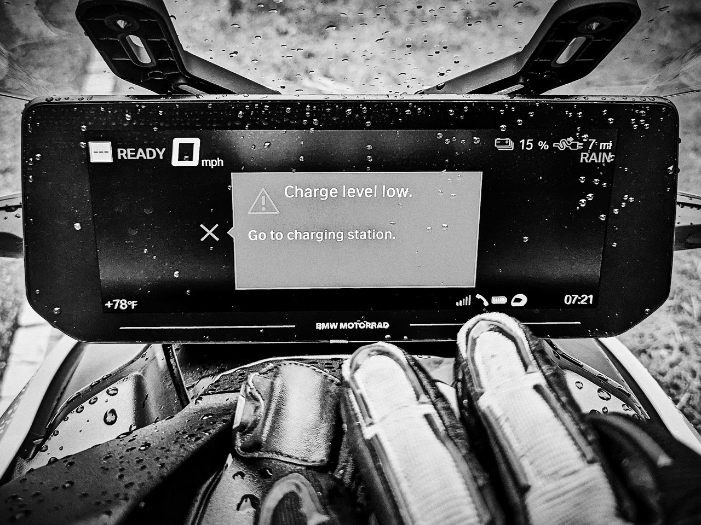

There is that pernicious little formula that says: the energy required to overcome wind resistance is cubic to velocity. On a two-wheeled EV, even going 5mph over the speed limit has a noticeable impact on the range. Thankfully, my route pulls me off the highway at the next turn and puts me on slower backroads, so I arrive at the charger with 11% left.

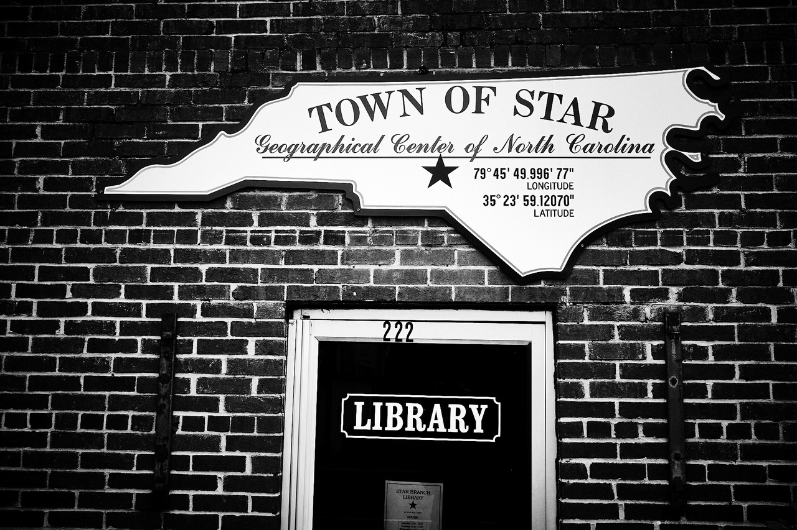

I set my rain gear out to dry, set my stopwatch for 45 minutes and begin walking around in search of a bathroom, coffee, and breakfast. At 8 am on a Friday, I already know my best option is a convenience store/gas station a half-mile up the road. The town of Star is small but oozing with character: from the rail yard to the auto shop to the jail. It feels great to be exploring on foot for a change.

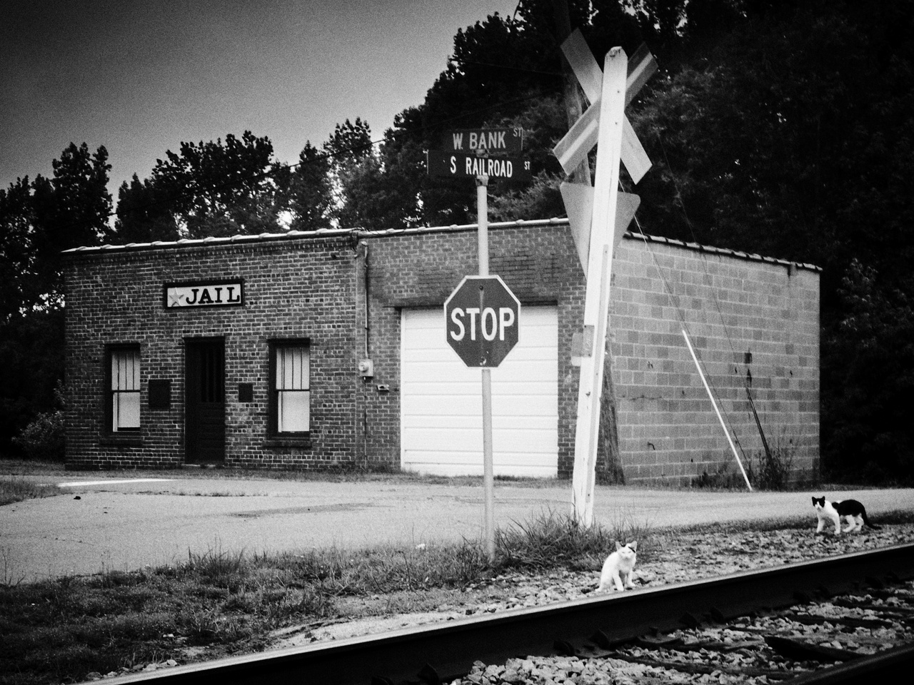

At the convenience store, an older gentleman is scratching off what appears to be an unlimited number of lottery tickets. A younger gentleman ahead of me grabs a coffee and lines his pockets with an innumerable amount of half & half containers. I hit the restroom, grabbed a shitty pre-manufactured pastry and a mediocre cup of coffee, and headed to the park across the street to enjoy them.

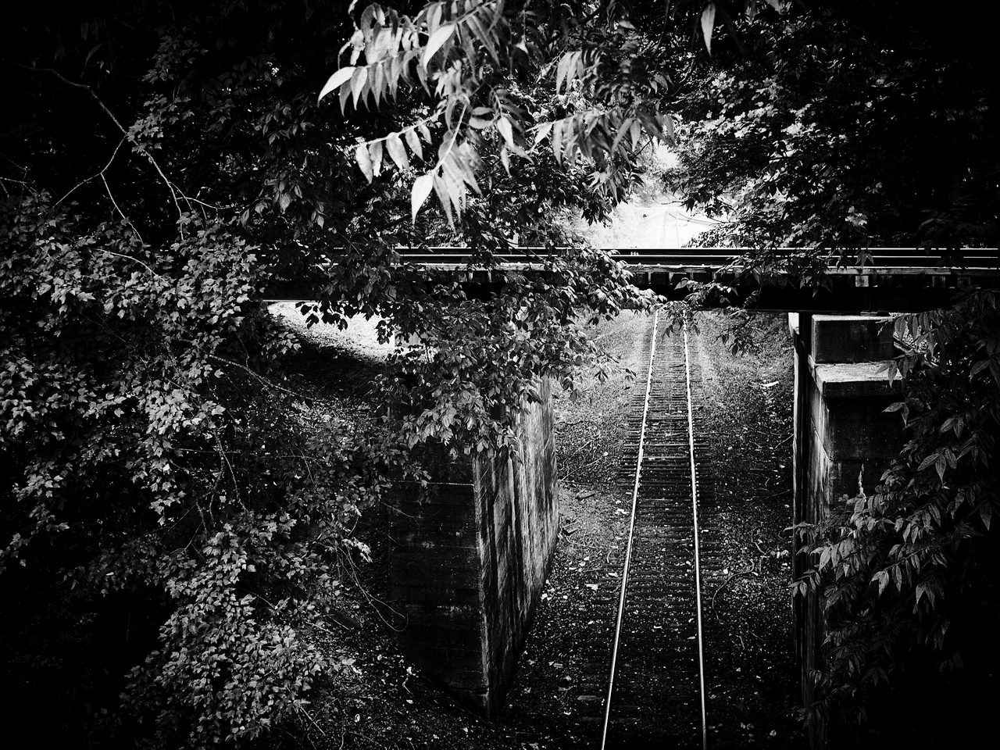

### Heading to Town

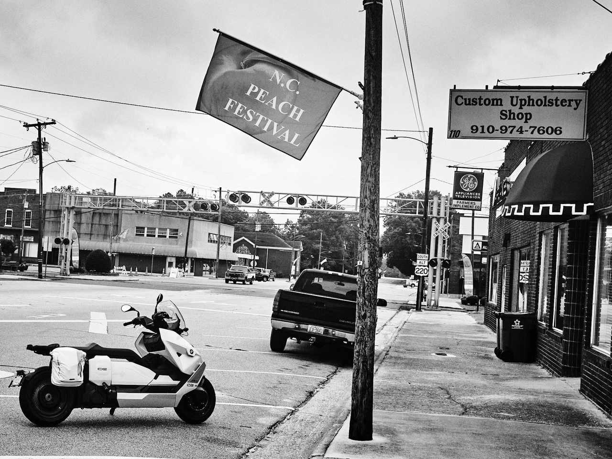

From Star, I head south on Alt 220 through Biscoe and Candor (home of the NC Peach Festival) and eventually onto a 4-mile unpaved road named "Lovin Hill Rd." There were one or two pucker moments as the road alternated between crushed stone, mud, and sand, but overall it was in good condition. I loved the experience and could not wait for it to end.

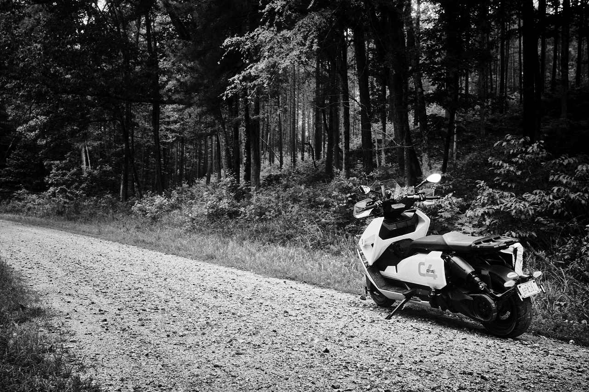

I was more mindful about my throttle this time and arrived at Town Creek with plenty of battery left. If I had been low on charge, my plan was to politely ask one of the rangers if I could use one of their external power outlets.

Town Creek is North Carolina's only state-run park focusing on its Native American heritage. The site was an active village built by people from the Pee Dee culture and occupied from 1150—1400 AD. The villagers abandoned it for unknown reasons before the Europeans landed in North Carolina in 1524. The going theory is that they moved west to the Catawba River.

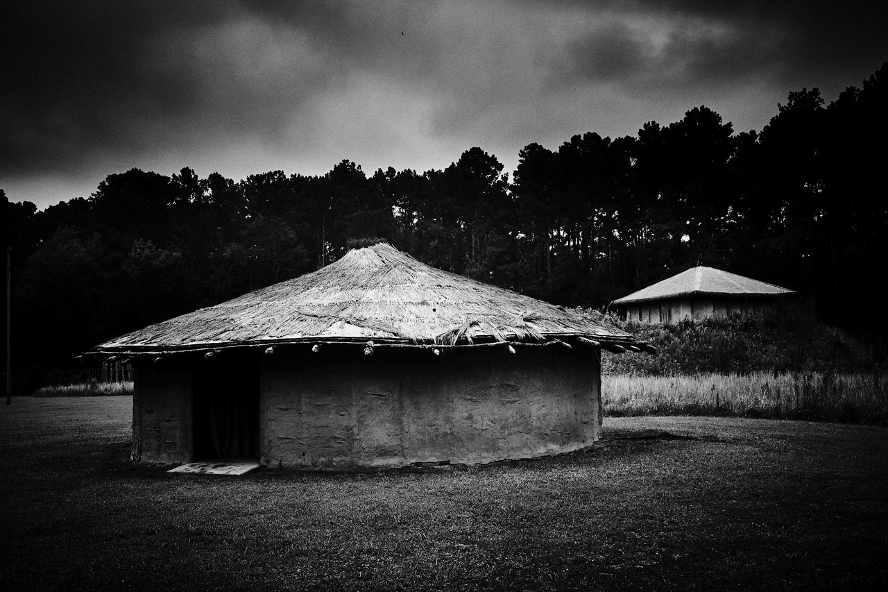

I'm behind schedule, so I skip the movie, look at their surprisingly thin amount of artifacts, and head out the backdoor to the archeological site. They've reconstructed the palisades, a handful of buildings, and the mound. I was a little disappointed in the lack of artifacts shown, but it's definitely worth checking out if you are in the area.

### A prehistoric quarry

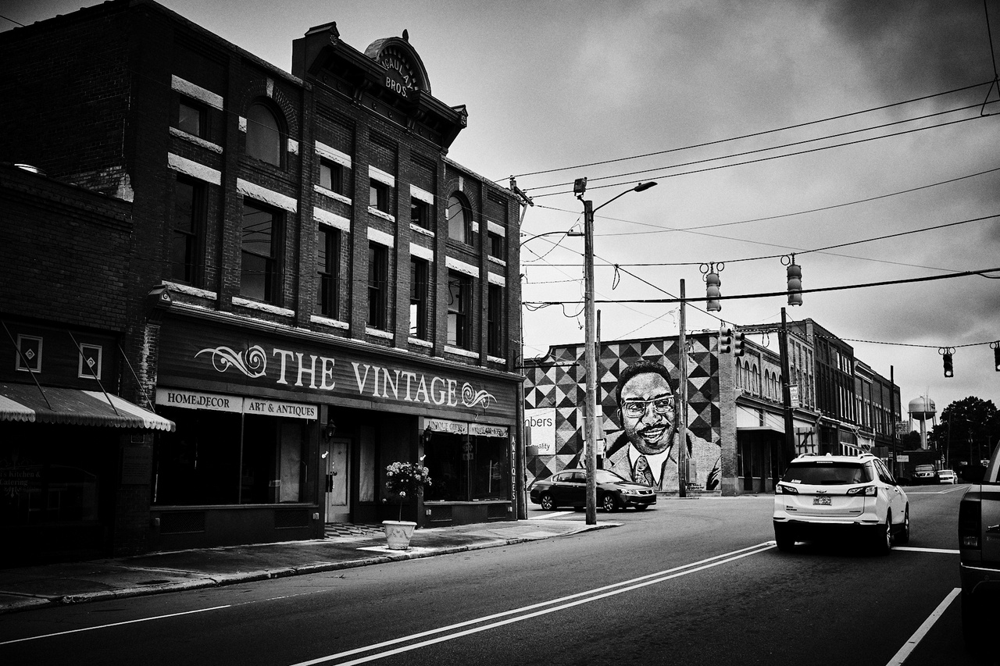

Heading Northwest on 73 and 27, I cross over the great Pee Dee River. The river is over 1000ft wide at this point, which allows the Uwharrie Mountains to be visible behind them. The Yadkin River joins the Uwharrie north of here, and the river today has a series of dams and reservoirs that likely contribute to the width.

The Uwharrie Mountains are little known outside of North Carolina but are one of the oldest mountain ranges in the United States. They are at least 20 million years older than the Appalachians and once rose to some 20,000 feet before eroding to just over 1,100 feet. In recent history, the Uwharrie was a famous hideout for Civil War draft dodgers before Zebulon Vance ordered it cleared out.

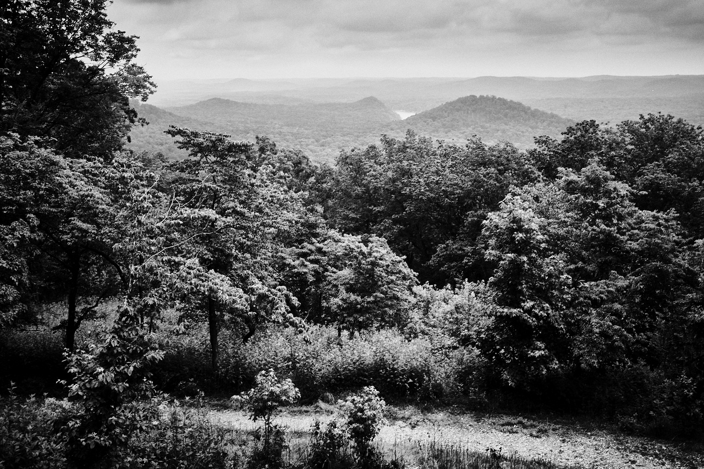

The Uwharrie Mountains were also volcanically active, resulting in a lot of rhyolite - a social-rich volcanic rock that lends itself to prehistoric tool making. By the time 10,000 BC rolled around, Morrow Mountain, in particular, had been turned into one of America's oldest rock quarries. If you wanted a sharp arrowhead or spear, it's gotta be genuine Morrow Mountain Rhyolite. Tools made from this mountain were traded throughout the East Coast and have been found in archeological sites from Maine to Florida.

The roads through Morrow Mountain State Park are gorgeous, and my first taste of mountain twisties is on the BMW CE-04. Initially, I didn't feel I had precise control of it in the tight turns, but it felt great nonetheless.

### Ablemarle: a weird place

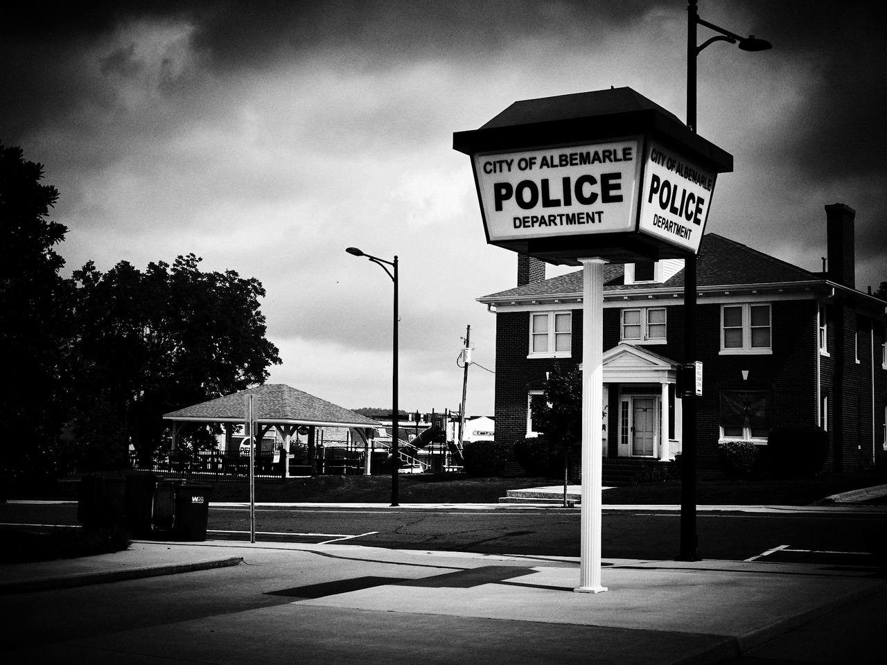

Albemarle is a weird-feeling town - it feels far more significant than one would expect for a population of 15,000, with oodles of large government buildings. In retrospect, that makes a lot of sense, given that it is the county seat, albeit a small one. Albemarle is an old textile town with a surprisingly lovely-looking downtown area - but it was devoid of commercial activity, with only a single place open for lunch.

I'm an hour behind schedule, so I get lunch in Albemarle instead of Charlotte and charge up beside the police department and courthouse. On the way to eat, I dodge two police officers and a schizophrenic lady. I first overheard her yelling at the sky while unpacking the bike, so I carefully concealed the side bag with my jacket before walking away from the parking lot.

### Fuck Charlotte

I was heading to Charlotte, NC, not because it made sense thematically but because I was meeting two old friends. I was running late, and I got my times a bit mixed up as I use two apps for trip planning:

- [ABetterRoutePlanner](https://abetterrouteplanner.com/) (now owned by Rivian), which takes charging times into account and even recommends chargers along the route but does not know about the current state-of-charge

- [BMW Motorrad Connected](https://www.bmwmotorcycles.com/en/engineering/connectedride.html#/section-comprehensive-options), the only app displayable on the scooter's massive 10" screen, gives time estimates but neglects to consider charging times or recommend charging stops.

While programming the route in both apps, I initially added a second charging stop in East Charlotte but later removed it from ABRP as it was unnecessary. The time estimate was for that charger rather than the Starbucks.

Once I realized my mistake, reaching the correct destination took me another 15 minutes. Once plugged in, I punched up Starbucks on Google Maps and began walking. It turned out to be the wrong Starbucks, as multiple of them existed at the same intersection. My friend was, in fact, at a 3rd Starbucks elsewhere. The heat was killing me, so I wasn't going anywhere, and I forced my friend to meet me wherever the fuck I actually was.

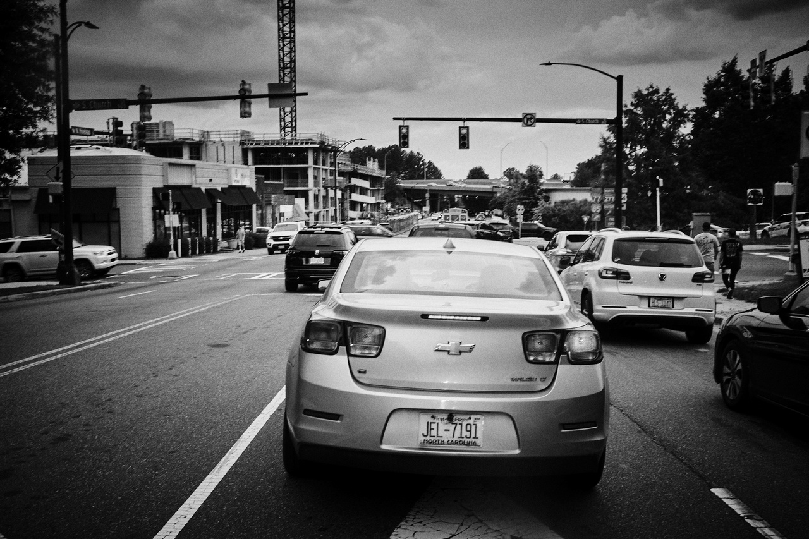

Hanging out with friends was great but it also forced me into Charlotte rush hour. Not commuting by anything but bicycle or a metro train for the last 13 years, I forgot that rush hour was a thing. The BMW Connected app helpfully routed me in front of Charlotte's largest stadium, where folks were lining up for a country music show. The traffic was traumatic in the heat, and a lack of clarification on when and where filtering was allowed had me join in with what the cars were doing. Not being a US citizen, I try my best not to challenge local conventions.

On the way out, I noted the Iswa Nature Preserve on the way out, named after the Catawba tribe of Native Americans who used to live along the nearby river.

### Charming Cherryville

The Nav system recommended routing through Cherryville instead of riding through Shelby, so I rode up 274 to do so. The roads were lightly twisty with a light flow to them. As I was within a few hundred feet of a charger, I stopped by for a quick top-off as an insurance policy and an excuse to explore the town. In the parking lot, the welcome committee vehicle awaited me:

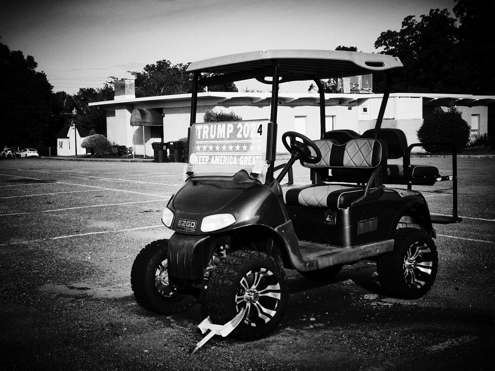

The town looked cute, but nothing seemed open, even on a Friday evening. I was in and out of there within 10 minutes.

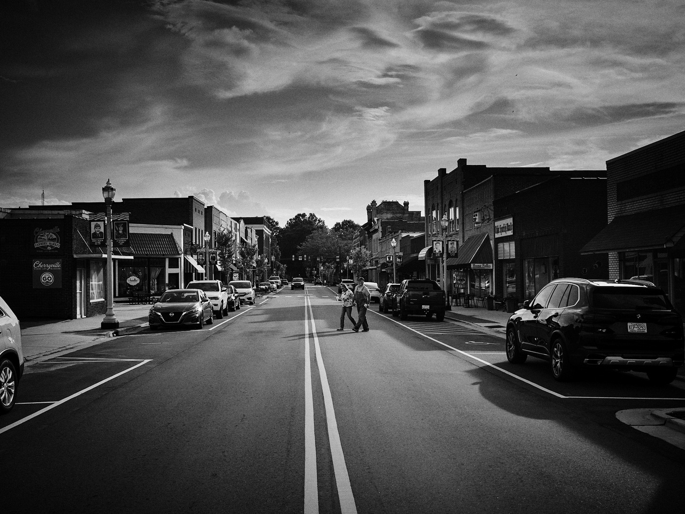

### Rutherfordton: the unpronounceable town

When the GPS announced the name "Rutherfordton", it sounded like "Rufton," so I asked a local. She said, "No, that's not it. It's Rufton". It sounded the same to my ears, but perhaps some subtle garbled half-hearted syllables were added in for good measure. Regardless, Rutherfordton was where the [Carrier House B&B](https://carrierhouses.com/) was and my final destination for the day. I didn't arrive there until 7:50 pm.

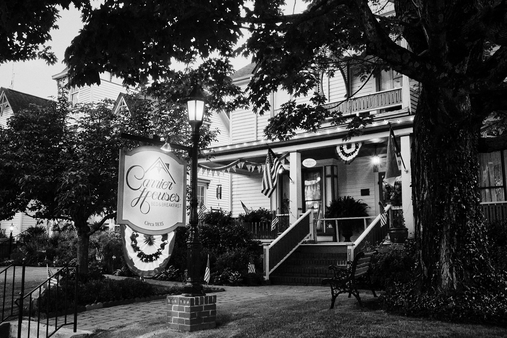

I got to talk at length with the proprietors, who offered to let me park the CE-04 in their garage so that it could be charged overnight. They also pointed me to the Copper Penny Grill, which had a fantastic glazed salmon dish and a great beer selection.

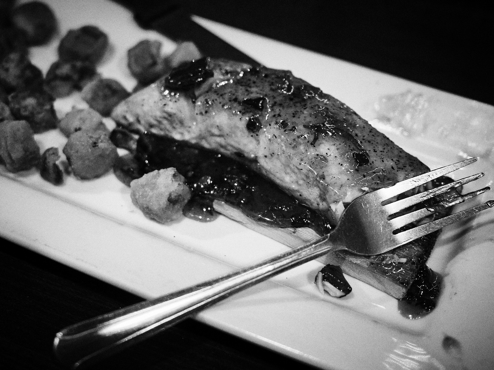

After dinner, I fell asleep quickly. It'd been 14 hours since I had left my driveway, with 260 miles traveled. At least 4 hours were spent charging, but instead of waiting, I wandered around with a camera in hand.

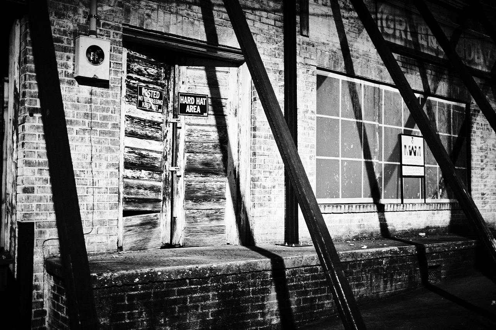

Tomorrow the twisties await.