This weekend, I took my funky electric BMW CE 04 camping at the edge of the Uwharrie Mountains for 3 days, covering 170 miles (270km). The trip was a breeze, so skip this post if you are looking for drama.

<!--more-->

This was an unofficial camping trip with folks from my daughter’s girl scout troop. She wanted to travel with her friends, but I still had to be prepared to take her home on the bike, so everything had to fit for the two of us:

From a packing perspective, the most creative thing I did was tape my tools to the back of the helmet compartment in the CE 04. There is an indented area on the back wall there that is otherwise unused:

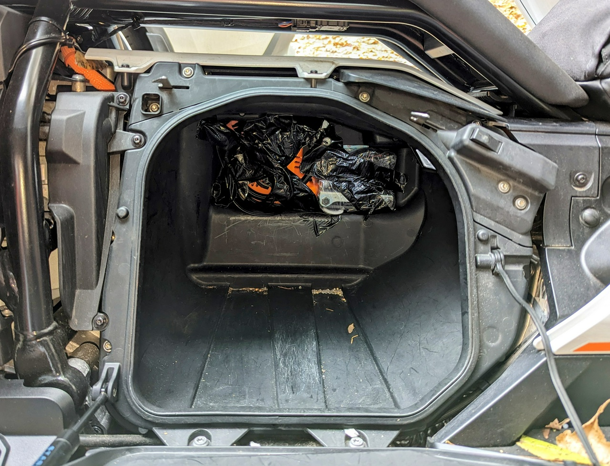

Once that’s in, the helmet compartment still easily fits a helmet or two sleeping bags and a J1772 charger cable:

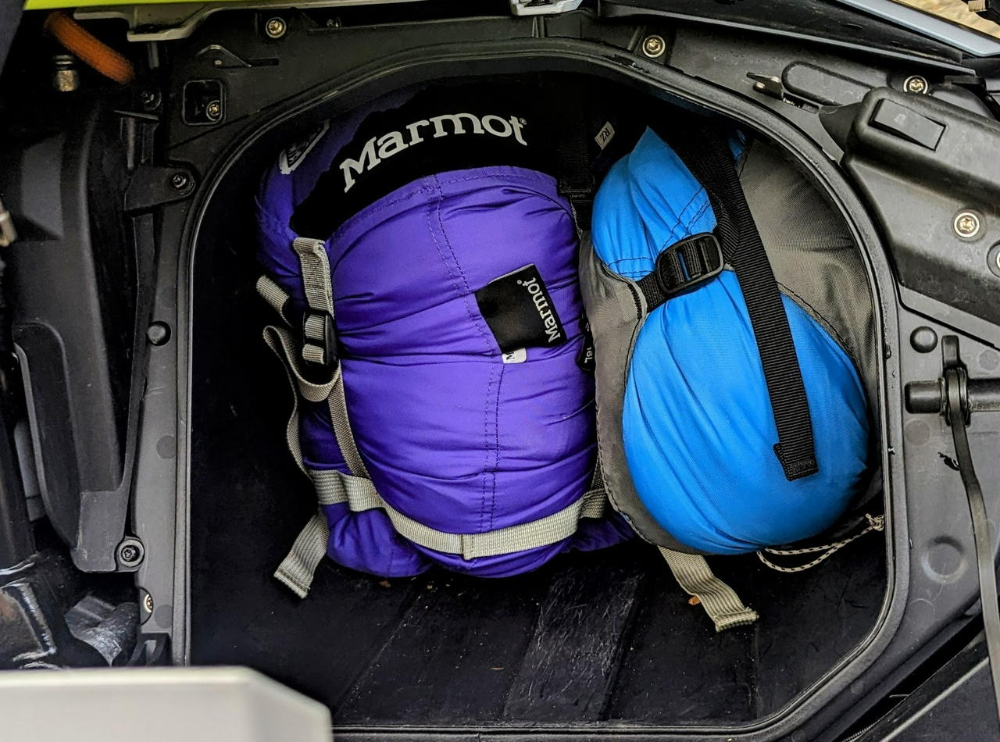

I didn’t mind if the tent and chairs got wet, so I placed them up against the top case.

The route I picked was setup so that I would charge twice in each direction so that I would have enough range to find a “Plan B” in case of a charging problem.  I found the chargers using PlugShare and then plugged them into BMW’s navigation software to find the twistiest route possible:

The first river crossing was the Haw River, named after the native tribe that once occupied this area. The tribe disappeared through death and assimilation after 1715, but the place names live on in their memory. North Carolina is filled with Native American history, and even today, North Carolina has the highest number of Native American residents (122,000) this side of the Mississippi.

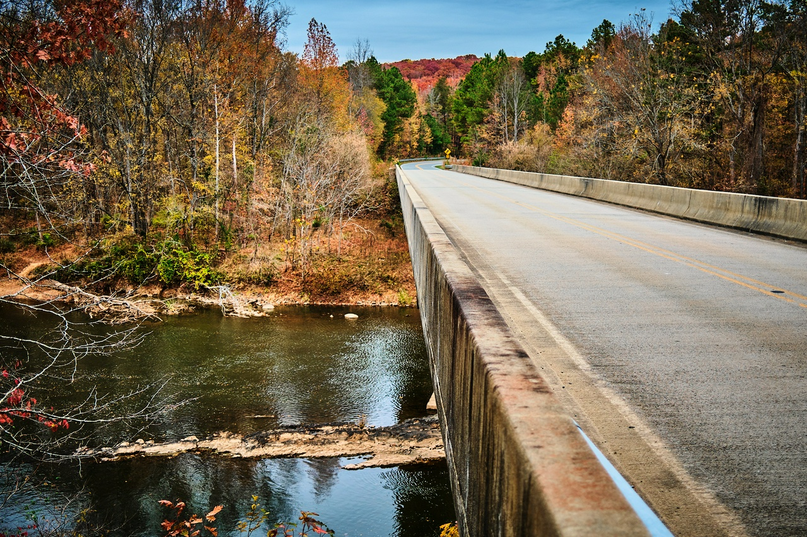

The first charging stop was at Welford Harris Ford in Siler City, where a most curious and friendly manager welcomed me. He’d never seen an electric motorcycle before. I usually avoid charging at car dealerships because they have the lowest likelihood of functioning in my experience. Dealerships never seem to have more than 1 charging port, which is often deactivated, locked away, in use by a dealership car, or deemed customers only.

Welford Harris Ford, on the other hand, is exceptionally friendly and has a great food options nearby, so you can fill your belly while you fill your battery:

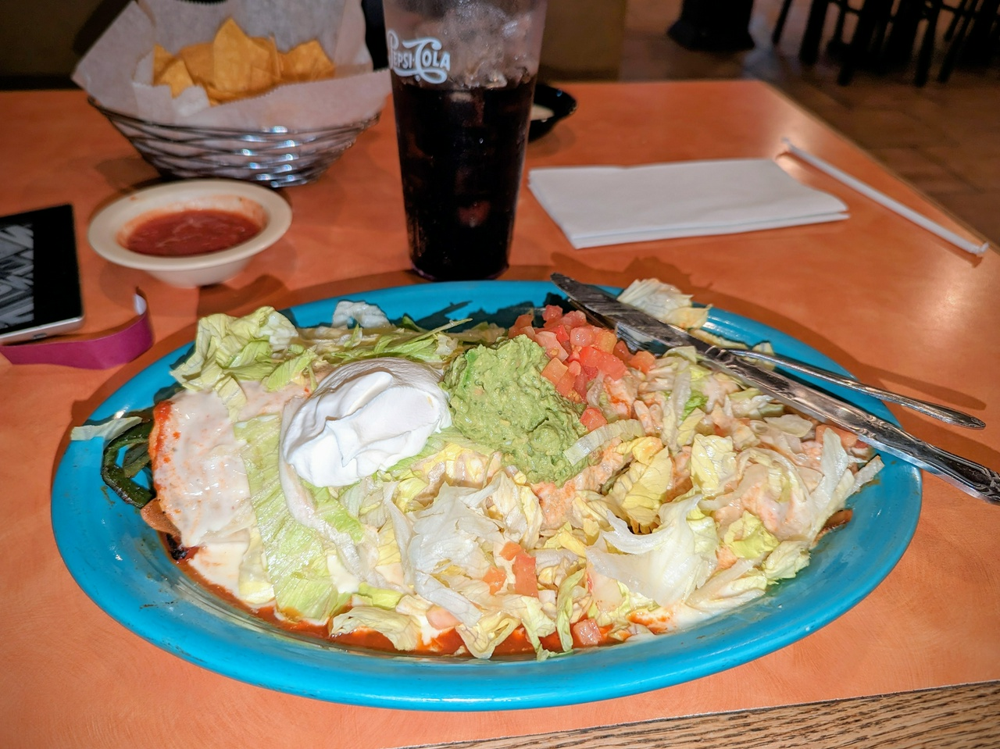

By the time I had lunch and returned to the bike, it had charged from 43% to 100%. Heading south from there toward the Deep River, I was soon welcomed by a series of abandoned barns, chicken coops & textile mills. Also: rain. Not enough to slow me down too much, but enough to make me take the curves carefully as they were filled with wet fall leaves.

At the Deep River, I encountered [Coleridge, home of Enterprise Manufacturing](https://northcarolinahistory.org/encyclopedia/coleridge/) - this cotton mill was built in the late 1800s, it’s been shuttered for the last 65 years:

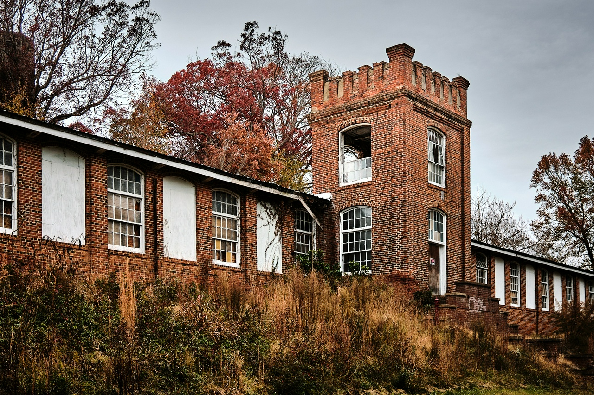

There was even 3-4 miles of quiet gravel roads to enjoy. It still blows me away how well the CE 04 handles gravel. Somehow, I feel more confident. on it in gravel than I did with my old F650GS Dakar.

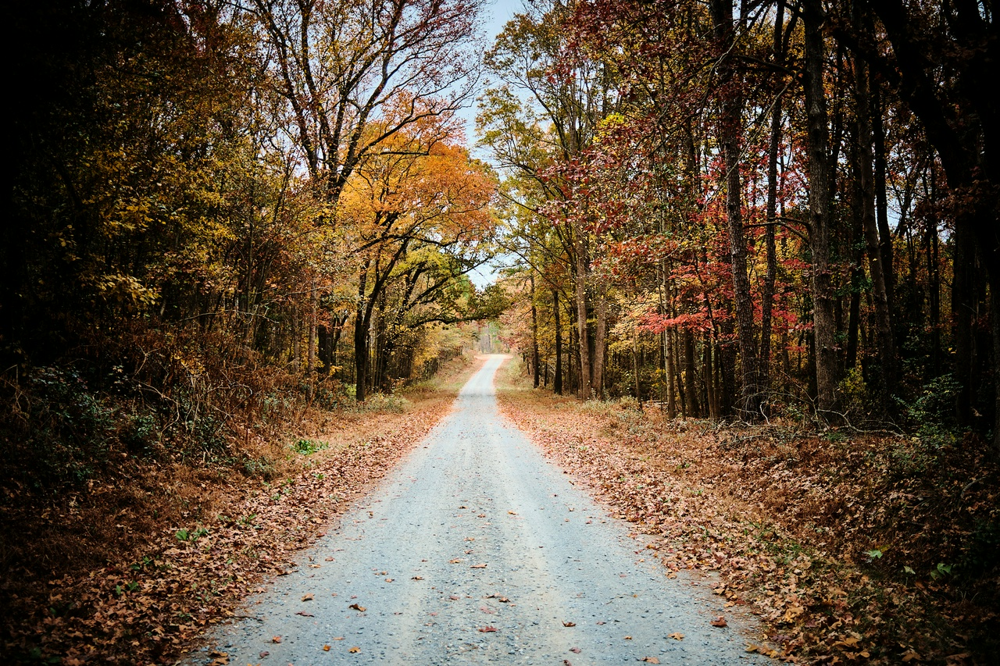

Just south of Asheboro, I stopped at the [North Carolina Zoo](https://www.nczoo.org/) for a free charge and a much needed bathroom break. I’m always skeptical of free chargers, as people often unnecessarily camp their cars out at them. It’s a cold & rainy day, and the zoo provides more chargers (6!) than anywhere else I’ve been outside of a Tesla Supercharger, so it was no hassle.

I went a little out of my way to check out Seagrove, the Pottery Capital of the United States. There are more working potters per capita here than anywhere else in the US. Every building in the town seemed to cater to pottery somehow.

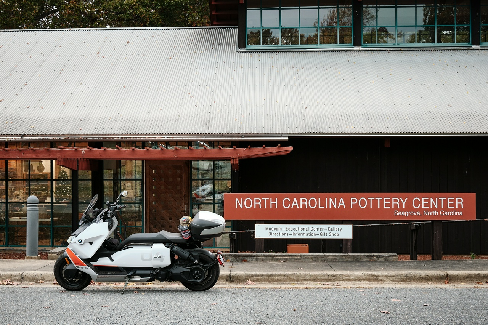

Heading south down via Ether Rd & Okeewemee (meaning “land between two rivers”), I avoided the highway and passed farm after farm: mostly cows, but also horses and sheep. I also noticed the youth of the trees here: it seems like everything around me had been clear-cut at least once in the last 25 years.

I soon arrived at our campground, an old farm in Troy, NC. It was gorgeous and peaceful. The host, Karl, was exceptionally welcoming and gregarious. He showed me around the expansive property, where I could charge my bike and place my tent, and welcomed me into his home. We soon had a campfire with smores.

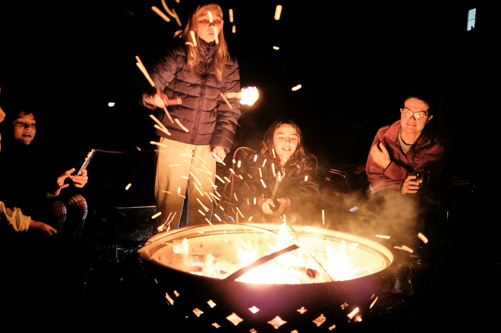

My new tent, the [Big Agnes Tiger Wall 2 (bikepacking version)](https://www.bigagnes.com/collections/tiger-wall-ul-bikepack-solution-dye-series/products/tiger-wall-ul-2-bikepack) was easy to set up and did not leak any rain: it’ll cozily fit two people and their gear and packs up exceptionally small. After a good nights rest, I woke up early in the morning to take some photos of the farm:

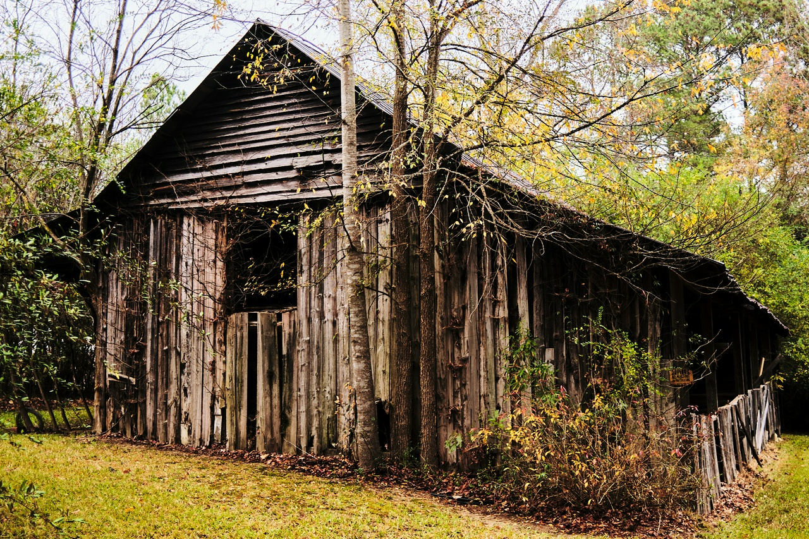

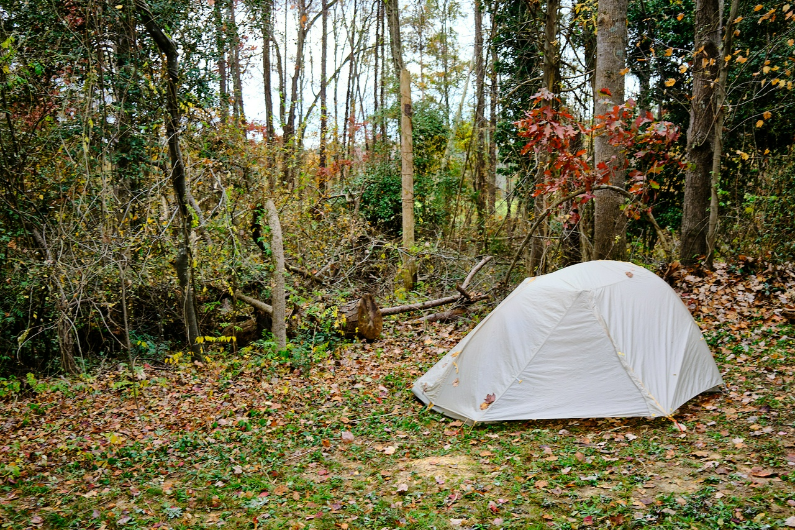

We made a day of going to the North Carolina Zoo in Asheboro, where I found my spirit animal, the [Colorado River Toad](https://en.wikipedia.org/wiki/Colorado_River_toad). I had read about the psychotropic characteristics of this species as a teenager and soon referred to my peers as “toadblowers” for reasons I still don’t understand.

The next day it was time to head home. As I had initially planned for my daughter to join me on the way home, I selected a known good route home with known-good EV charging options. She, however, decided to ride back with her friends, so I took the time to scout out some new charging options. Here’s the Blink Charger at Montgomery Ford in Troy, NC - you can charge a bike here, but they always leave a Mustang Mach-E parked here, so don’t count on charging your car:

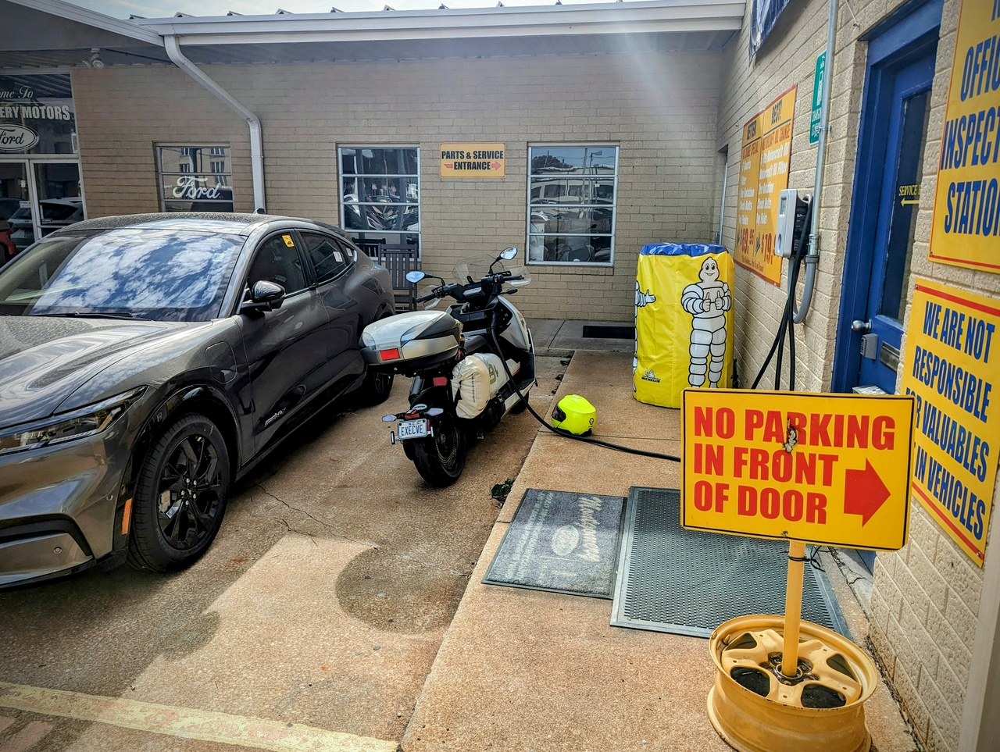

The nearby tiny town of Biscoe had a charger listed on PlugShare as vandalized and inoperable since July, so I dropped by to confirm that this is still the case. It’s weird to think that folks would vandalize an EV charger, but I imagine it was bored teenagers more than a nefarious group of anti-EV constituents.

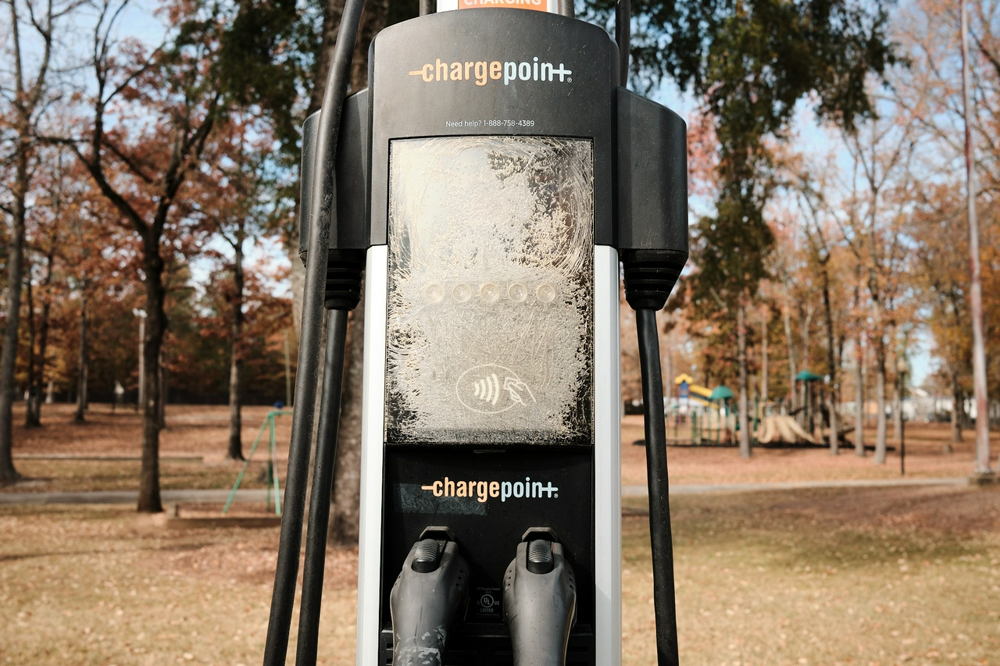

Robbins, NC, has my vote for the most charming small town in the Piedmont. It has a lovely EV  charger near a great coffee shop, walking trails, and Carolina Fried Chicken and House of Pizza (aka “Chicken Hut”) I stopped here to recharge myself and the CE 04: by the time I returned to the bike, it was at 99%.

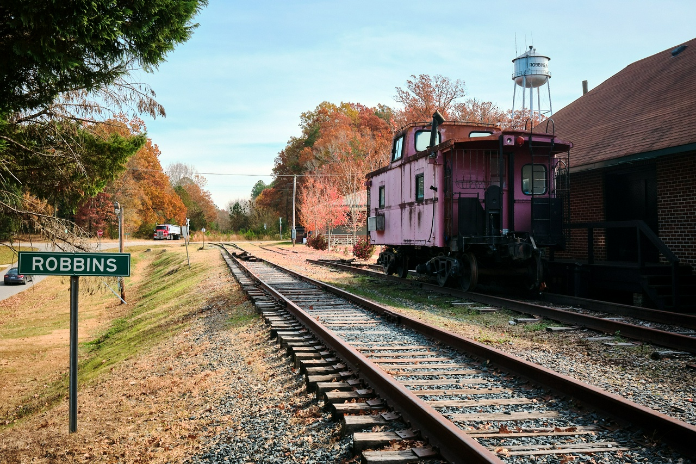

After Robbins, I followed River Rd for a beautiful twisty route along the Deep River. The fall leaves and gentle curves quickly instilled a sense of peace in me. The next and final planned stop was the charger at the Goldston Public Library, where I arrived with a 53% charge.

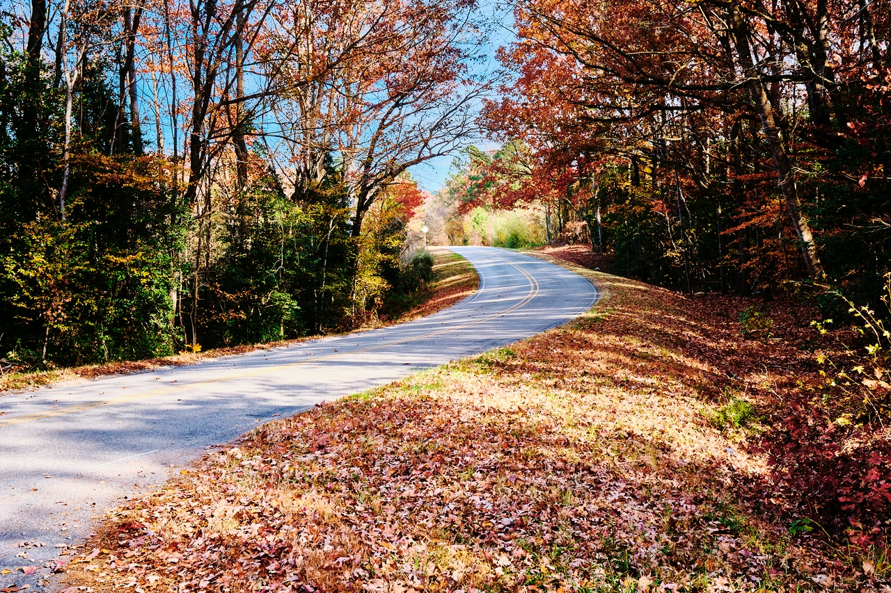

I was in a hurry to get home and made the mistake of going by intuition and unplugging the bike at 68% rather than looking up how much charge I needed. I thought I only needed a 55% charge to get home from there, but it turned out to be 72% - so I made one last charging top-off at the Chatham County Agriculture & Conference Center to add another 15% onto the bike before reaching home.

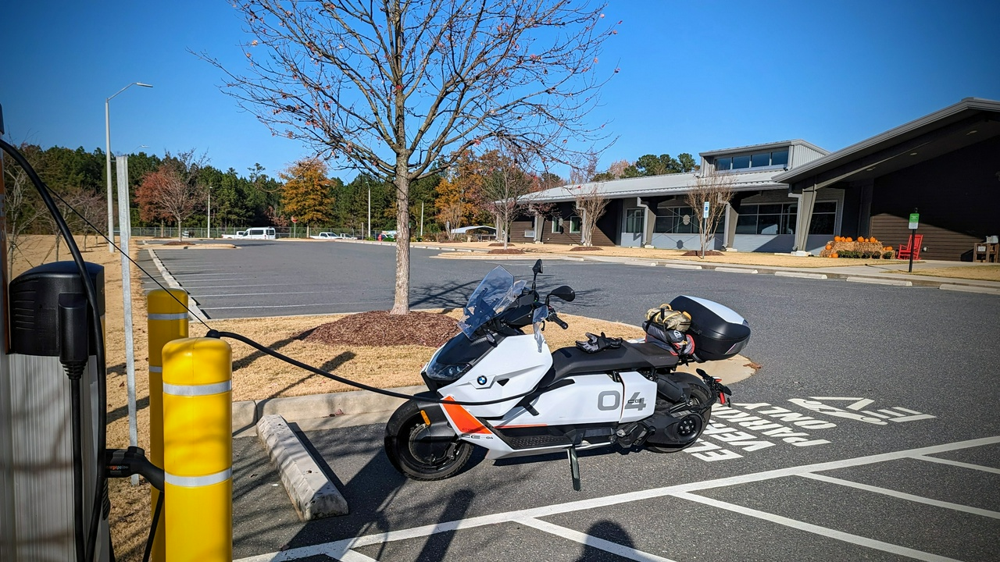

Thinking back to this trip, it amazes me how many people went into making such an adventure possible: from the folks who organized the campout to the engineers who designed the EV chargers, and the people who built the roads. It’s a good reminder that behind all this amazing technology is a sea of people working together for the greater good of. the world.

That thought fills my heart. Until next time, keep the shiny side up.