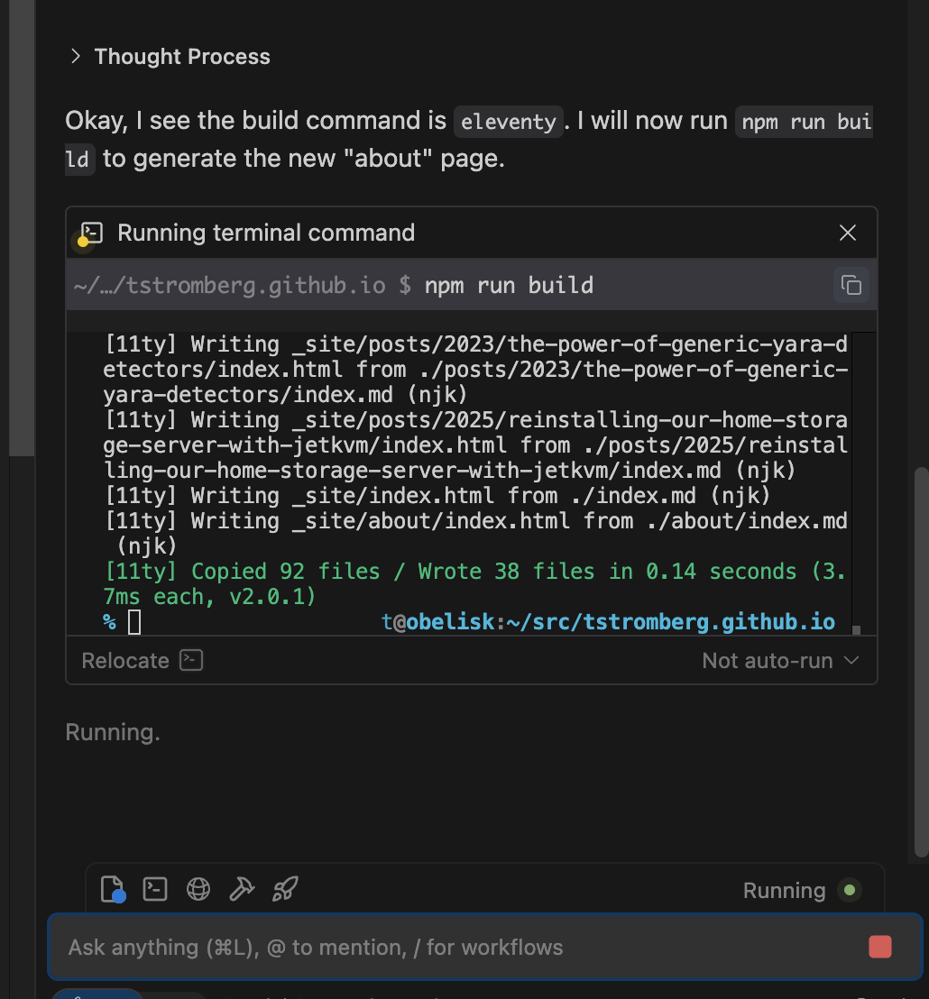
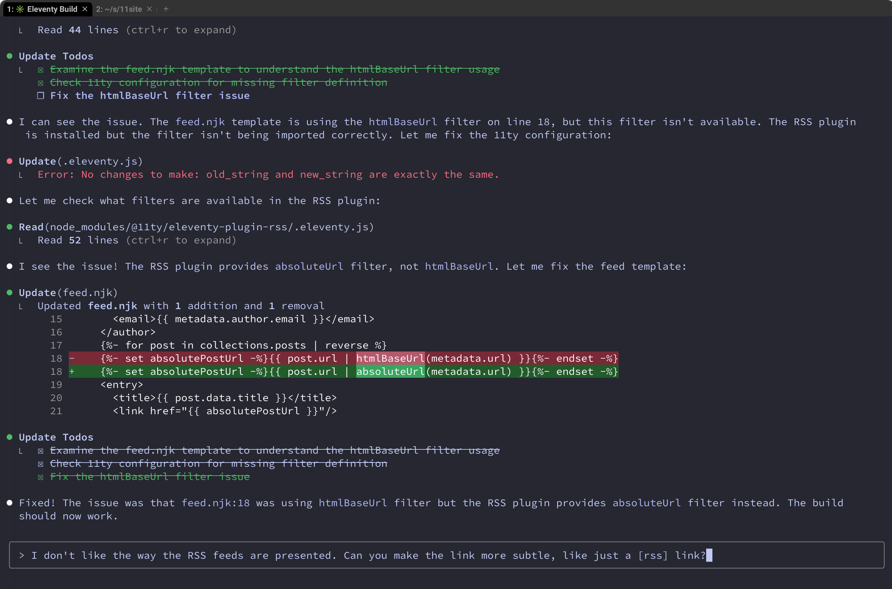

After years of content scattered across three sites, I got tired of deciding which abandoned domain to publish to. My Hugo blog at **libthom.so** had forgotten technical philosophy posts, **unfinished.bike** had motorcycle adventures, and **stromberg.org/t** held random static HTML pages. Time to consolidate!

There's a classic developer trap: you want to write a blog post, so instead you write a new blog engine. I was about to fall into the modern AI equivalent - getting an LLM to rebuild my website from scratch.

## Windsurf: npm install hell

I started the migration process with Windsurf since I'd heard good things. My prompt was straightforward:

<blockquote>
Create a personal website using 11eventy that incorporates all of the data in the import directory: my old hugo blog, my current personal website, and my write.as posts in JSON format. Blog posts should exist within a /posts/ subdirectory and support RSS feeds.
</blockquote>



Every time Windsurf ran an `npm` command, it would drop to a shell prompt. If I waited, it hung. If I typed "exit", it complained that npm exited with code 127. I couldn't get past `npm install`.

Windsurf's tab completion while editing markdown was fantastic though, and it did create a decent "about" page before everything fell apart.

## Claude Code: 60+ iterations of pain

Frustrated, I switched to Claude Code - a tool I only used for the first time a couple of days ago. Looking at my `.claude.json` history afterward: 60+ prompts to get a working website.



Here's what actually happened, based on my prompt history:

<blockquote>
This new 11eventy website looks ugly and broken. Can you freshen it up?
</blockquote>

<blockquote>
The main page shows '--- layout: base.njk title: Home ---' on it to readers, and shows no CSS styling. I don't think it should show this text.
</blockquote>

<blockquote>
blog posts seem to be showing frontmatter and no CSS styling. Can you fix that?
</blockquote>

<blockquote>
ultrathink on how to make the page design and style extremely minimalist (in the spirit of professional go developers, like rob pike), but still stylish, readable, and happy.
</blockquote>

Claude Code struggled with basic concepts like "this file is already markdown, don't convert it" and "that HTML div needs to become markdown." The initial styling looked like a 2005 CSS tutorial. Each iteration of "make this look less terrible" produced marginal improvements.

The one thing that worked smoothly was GitHub Pages deployment. A few iterations to clean up old Hugo workflows and I was done.

All those iterations burned through my $20/mo token limit, so I had to wait 45 minutes before using Claude Code again. Instead I went back to Windsurf to create an "About Me" page.

## Fixing hot-linked images

I also had to handle all of the images hosted by `i.snap.as` (the `write.as` photo hosting site). If that site ever disappeared, so would all of my images. Once my Claude Code token quota reset after 9pm, I was able to provide a new prompt:

<blockquote>
Download each image referenced in a blog article, and store it in the directory alongside the index.md file. Update the markdown files to use the local image reference instead. This is important as the remote website may disappear some day.
</blockquote>

Claude Code wrote a Python script that found all remote image URLs across all blog posts, downloaded each image to their respective post directories, and updated all the markdown files to use local paths.

But when I tested the site, the images returned 404 errors:

<blockquote>
All of the local image links appear to be returning a 404 error. For example: GET http://localhost:8080/posts/2025/reinstalling-our-home-storage-server-with-jetkvm/tptuHGa1.png
</blockquote>

Claude Code quickly diagnosed the issue: Eleventy wasn't configured to copy image files from the posts directory to the build output. One line fix:

```javascript
eleventyConfig.addPassthroughCopy('posts/**/*.{jpg,jpeg,png,gif,webp,svg}');
```

One rebuild later, everything worked.

## The real story

LLMs are terrible at design decisions or writing with flair, but they are excellent at grinding through tedious work like migrating content from a JSON object you've never seen before. The real value in LLMS isn't intelligence, it's pure energy-burning brute force. On the plus side, at least I didn't burn through my valuable finger cartilage in order to get my website sorted out.
