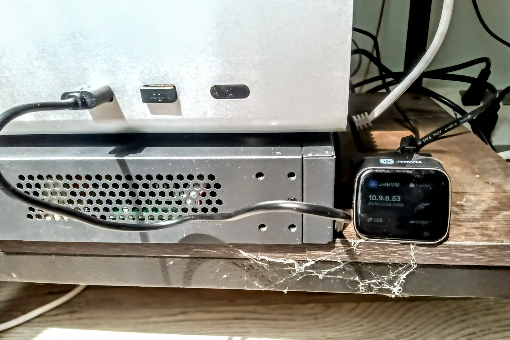
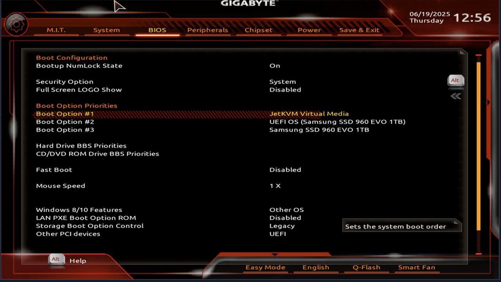
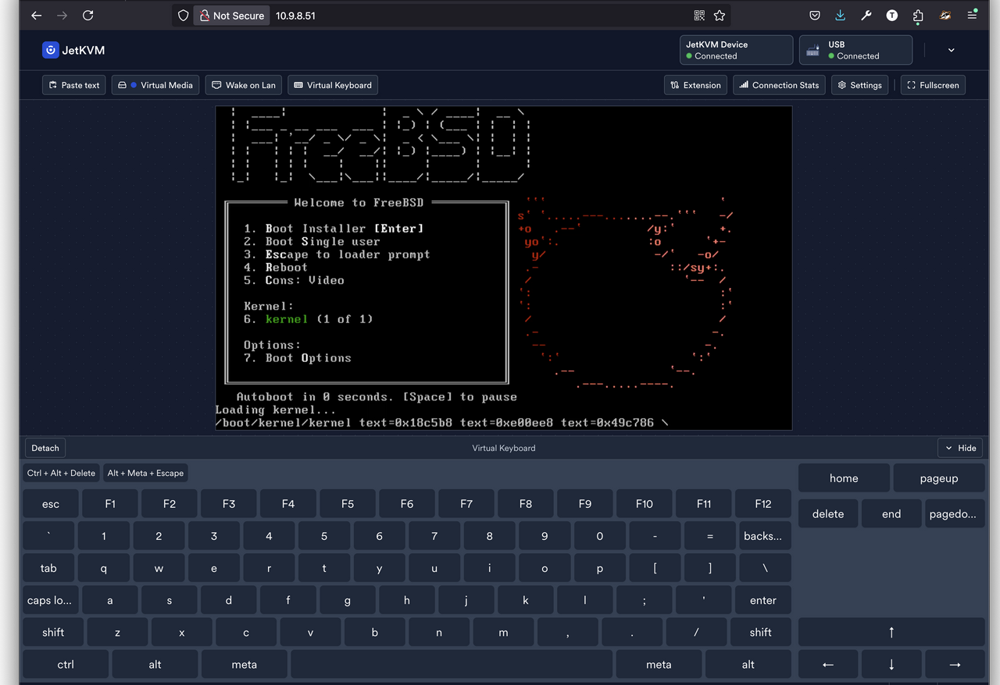
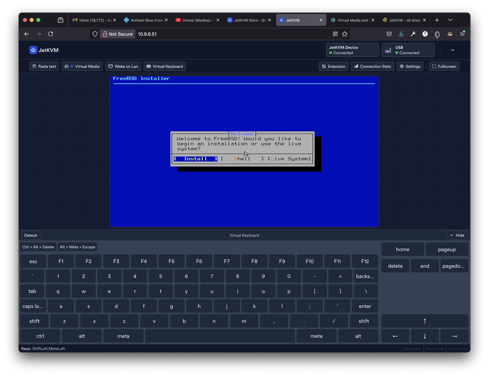
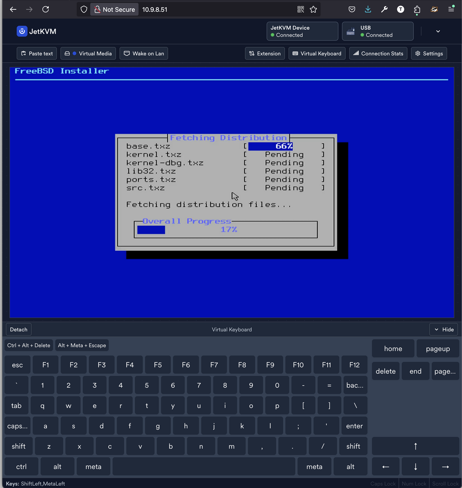
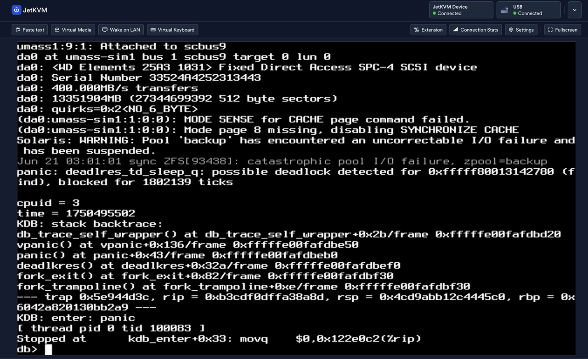

My home office space has been offline for the last two months due to the invasion of 20,000 honeybees. This article is not about that story.

However, when putting everything back into its place, I knew my home storage server running FreeBSD 15-CURRENT was overdue for a wipe and reinstall: it’d been 4 houses, several years, and a handful of domain names since it was initially installed.

One thing I hate about having a home lab is needing to crawl around to fetch a keyboard and monitor for reinstall and recovery ops. Enter the JetKVM, a nifty little device that promised to make this painful process a bit more bearable.

## Setting Up the JetKVM



JetKVM is a tiny & cheap hardware KVM-over-IP solution that lets you remotely control servers via a web browser. I’d ordered mine months ago via Kickstarter, but today was my first shot at using it.

Getting the JetKVM ready was refreshingly straightforward:

* Connect the HDMI cable
* Connect the USB-C cable
* Connect Ethernet
* Visit IP displayed on it’s tiny little screen with a web browser

Once I turned the machine on, I was greeted with a familiar boot screen that we’ve seen on PC devices since the 1980’s.

## Mapping Out the Existing Storage

I had 10TB of data on this machine to preserve, so I wanted to get a quick map of which disks were what before accidentally wiping something. If I’d been less lazy, I would have unplugged the drives with data.

`zpool status -v` revealed my storage layout:

* **slow**: ada1 (14TB spinning disk - my bulk storage)
* **zroot**: nda0p4 (NVMe drive confirmed via the [nda(4) man page](https://man.freebsd.org/cgi/man.cgi?nda(4)))
* **fast**: ada0 (4TB SATA drive)

FreeBSD's device naming is logical once you know the patterns: `nda` for NVMe, `ada` for SATA/PATA drives.

## Booting FreeBSD ISO using JetKVM Virtual Media

From my MacBook Pro, I started to setup a bootable USB drive using this classic incantation:

```
sudo diskutil list | grep external
/dev/disk4 (external, physical):
```

```
sudo dd if=$HOME/Downloads/FreeBSD-15.0-CURRENT-amd64-20250612-e6928c33f60c-277883-mini-memstick.img of=/dev/disk4s1 bs=10240
```

I used the JetKVM virtual keyboard to insert the “Del” button to enter BIOS and set the boot device order up so that it would boot off of the USB stick. But wait, what’s this “JetKVM Virtual Media” device?



Then I noticed this curious “Virtual Media” button in the JetKVM screen - was it possible to upload a disk image to this thing and boot it up without worrying about USB sticks and dd commands? It turns out you can - what a game changer:

* Click “Virtual Media
* Click “Add New Media”
* Click “JetKVM Storage Mount”
* Select local file, click Upload
* Click “Mount File”



One quirk I discovered for FreeBSD is that only the CD/DVD ISO image boots properly via JetKVM Virtual Media, not the memstick images.

## Navigating Installation Quirks



It’s been nearly 30 years after my first FreeBSD installation (2.2.0), and I still find new quirks that cause me to go into menu loops. This time it did not like that my system already had a “zroot” pool defined. This was easy enough to fix by selecting the “Shell” option from the partitioning menu:

```
zpool import zroot
zpool destroy zroot
```

After that, the rest was smooth sailing.



## Configuring Remote Access

The JetKVM is fine as an emergency connectivity option, but nothing beats SSH and a static IP for ease of use. I immediately dove into `/etc/rc.conf` and defined:

```bash
ifconfig_igb0="inet 10.9.8.7 netmask 255.255.255.0"
```

FreeBSD makes it easy to reconfigure interfaces based on the stored configuration:

```bash
/etc/rc.d/netif restart
```

I like configuring SSH (`/etc/sshd/sshd.conf`) avoid brute-force attacks from flooding the logs, as well as make them hopeless:

```
Port 32022
PasswordAuthentication no
KbdInteractiveAuthentication no
PermitRootLogin yes
```

Another quick service restart and SSH was ready:

```bash
/etc/rc.d/sshd restart
```

## The Connectivity Plot Twist

Here's where my smooth reinstall hit a snag. After getting everything configured, I couldn't reach GitHub:

```bash
$ git clone https://github.com/tstromberg/commit-etc.git
Cloning into 'commit-etc'...
fatal: unable to access 'https://github.com/tstromberg/commit-etc.git/': Failed to connect to github.com port 443 after 23 ms: Could not connect to server
```

DNS was working fine - `host github.com` returned the expected results:

```bash
$ host github.com
github.com has address 140.82.114.4
github.com mail is handled by 10 alt4.aspmx.l.google.com.
github.com mail is handled by 1 aspmx.l.google.com.
...
```

But trying to actually connect revealed the issue:

```bash
$ curl -vvv github.com
== Info: Host github.com:80 was resolved.
== Info: IPv4: 140.82.112.4
== Info:   Trying 140.82.112.4:80...
== Info: Immediate connect fail for 140.82.112.4: Network is unreachable
== Info: Failed to connect to github.com port 80 after 23 ms: Could not connect to server
curl: (7) Failed to connect to github.com port 80 after 23 ms: Could not connect to server
```

The culprit? I'd forgotten to set the default gateway. I added `defaultrouter="10.9.8.1"` to `/etc/rc.conf` and restarted routing:

```bash
/etc/rc.d/routing restart
```

I liked having the extra security blanket of the JetKVM in case I botched the networking configuration.

## Essential Tools and Services

Once connectivity was restored, I could install my usual set of server tools:

```bash
pkg install tmux fish git doas rsync go syncthing
```

SyncThing gets special mention here as my go-to solution for keeping files synchronized across machines. It deserves it's own article, but getting it running is just:

```bash
sysrc syncthing_enable=YES
/usr/local/etc/rc.d/syncthing start
```

The `sysrc` command is FreeBSD's clean way to modify `/etc/rc.conf` programmatically - less error prone than manual edits.

## Configuration Management

I also needed to get my system configuration management back online. My approach is to keep `/etc` under version control with a simple script setup:

```bash
git clone https://github.com/tstromberg/commit-etc.git

cp commit-etc.sh $HOME/commit-etc

$HOME/commit-etc/commit-etc.sh

echo "0 0 * * * $HOME/commit-etc/commit-etc.sh" |crontab -e
```

Now any system changes I make will be automatically translated into git commits.

## Panic!

The FreeBSD “CURRENT” stream is considered “alpha” quality and well-known for stability issues. Even so, I was surprised to get a panic so quickly, induced by my attempt to sync terrabytes worth of data to an external drive via USB 3.0:



The JetKVM proved its worth here too - as it made persistent out-of-band access to my server a painless affair. Otherwise, I would have had to fetch a monitor out to see the panic message.

After some tweaks, FreeBSD 15-CURRENT is running smoothly now, with a clean ZFS setup and all my essential services back online. The combination of solid documentation (those man pages!), logical device naming, and straightforward service management makes FreeBSD a pleasure to work with, even during major system changes.